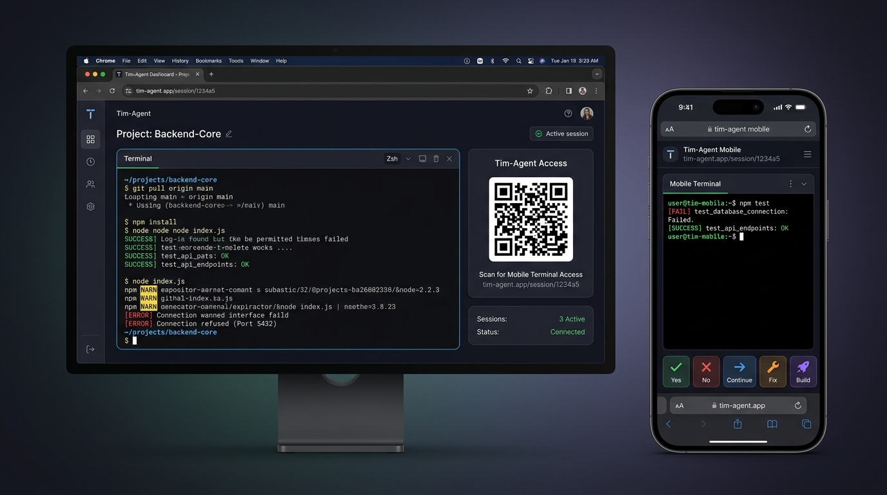

# Tim-Agent 🚀

<p align="center">
  
</p>

<p align="center">
  <strong>Native GUI Terminal Agent & Mobile Vibe Coding Hub for Claude Code, Codex, Opcode, Pi & Gemini</strong>
</p>

<p align="center">
  <a href="https://github.com/tim-today/tim-agent/actions"></a>
  <a href="https://github.com/tim-today/tim-agent/releases"></a>
  
  
  
</p>

<p align="center">
  
</p>

---

<p align="center">
  <a href="#english">English</a> | 
  <a href="#简体中文">简体中文</a> | 
  <a href="#繁體中文">繁體中文</a> | 
  <a href="#日本語">日本語</a> | 
  <a href="#한국어">한국어</a> | 
  <a href="#deutsch">Deutsch</a>
</p>

---

<a id="english"></a>
## 🇺🇸 English

### 🎯 Core Purpose & Philosophy
**Tim-Agent is purpose-built for seamless bidirectional task collaboration between Mobile Phones and PC workstations.**  
Traditional remote terminal setups are frustrating on mobile touchscreens and break connections when screens lock. Tim-Agent provides a zero-friction mobile companion terminal for your desktop workstation.

### 🌟 Why Tim-Agent?
1. 🛡️ **Zero API Token Setup & Zero Leakage Risk**: No need to provide, store, or proxy sensitive LLM API keys. Tim-Agent does not handle credentials, eliminating any risk of token leakage.
2. 💻 **Inherits 100% of Native Host Environment**: Works directly inside your local project folders. Automatically utilizes your local Git credentials, SSH keys, compiler tools, virtual environments, and shell configs.
3. 🔄 **Seamless Cross-Device Relay (Phone ↔ PC)**: Start a task at your desk, continue on your phone while walking away; approve changes on mobile, and pick up right where you left off when back at your PC.
4. ⚡ **Resilient to Network Jitter & Drops**: Decoupled from fragile SSH pipes. The host PC daemon continues executing builds, tests, and AI agent reasoning uninterrupted in the background. Whether you switch from Wi-Fi to 5G or step into an elevator, reconnecting instantly resumes the live session without any disruption to ongoing tasks.
5. 🤖 **Powered by Official First-Party AI Agents**: Directly drives official tools like Anthropic Claude Code CLI, OpenAI Codex CLI, and Google Gemini CLI. Avoids underpowered third-party wrappers, ensuring state-of-the-art reasoning quality and zero update delay.

### ⚡ Quick Start (Zero Download)
Run instantly via Go without cloning or manual binary downloads:
```bash
# 1. Run with defaults (launches dashboard & system tray)
go run github.com/tim-today/tim-agent@latest

# 2. Specify AI agent, directory, and port
go run github.com/tim-today/tim-agent@latest -agent claude -dir /path/to/project -port 20996

# 3. Enable auto-approve / bypass sandbox for AI tools
go run github.com/tim-today/tim-agent@latest -agent codex -auto-approve
```
*Or install globally:*
```bash
go install github.com/tim-today/tim-agent@latest
tim-agent -agent claude
```

### ⚙️ Command-Line Arguments
| Flag | Type | Default | Description |
|---|---|---|---|
| `-agent` | `string` | `""` (Shell) | Default AI Agent preset (`claude`, `codex`, `opcode`, `pi`, `gemini`) |
| `-port` | `int` | `20996` | Terminal port (auto-increments if busy; admin dashboard on `20997`) |
| `-dir` | `string` | Current dir | Working directory bound to the terminal session |
| `-auto-approve` | `bool` | `false` | Auto-approve prompts / bypass sandbox for Claude Code & Codex |
| `-password` | `string` | Auto-gen | Web terminal password protection (cached after first login) |
| `-shell` | `string` | System `$SHELL` | Custom shell executable (`/bin/zsh`, `/bin/bash`, `powershell.exe`) |
| `-no-open` | `bool` | `false` | Do not automatically pop up local dashboard in browser on start |
| `-remote` | `bool` | `false` | Enable remote access to web dashboard (default localhost only, requires password) |
| `-daemon` | `bool` | `false` | Run with supervisor watchdog for auto-recovery, ensuring 24/7 port uptime |
| `-version` | `bool` | `false` | Print version information and exit |


### 🌐 Remote Access & Networking
Tim-Agent serves the shared terminal on port `20996`. For remote mobile access, we recommend:
- **[Tailscale](https://tailscale.com/) (Recommended)**: Zero-config private mesh VPN. No port forwarding needed; scan the dashboard's auto-generated QR code to connect instantly.
- **[FRP](https://github.com/fatedier/frp) / Tunneling**: Forward port `20996` through your public VPS for remote cellular access anywhere.
- **LAN (Wi-Fi)**: Direct connection within the same local network via the LAN QR code.

---

<a id="简体中文"></a>
## 🇨🇳 简体中文

### 🎯 项目初衷与核心价值
**Tim-Agent 重点解决「手机与 PC 之间的任务协同」问题。**  
开发者经常需要在手机上监控或远程处理电脑端的长时间构建、测试任务，或与 AI 命令行 Agent（如 Claude Code CLI、Codex CLI）交互协同。传统远程终端连接方案不仅手机触屏极难操作，且断网重连与输入体验极差。Tim-Agent 让手机成为电脑端终端任务的最佳协同副屏。

### 🌟 项目核心特点
1. 🛡️ **无需配置 API Token，零泄密风险**：无需在网页或配置文件中填入任何大模型 API Key。Tim-Agent 本身不存储、不中转任何密钥凭据，彻底杜绝敏感信息外泄风险。
2. 💻 **完全沿用电脑本机环境与配置**：直接工作在电脑本机的项目目录中，自动继承开发者的 Git 凭据、SSH Key、编译器、Python 虚拟环境及终端 Alias 配置，无需在云端或容器重新折腾环境。
3. 🔄 **手机 ↔ PC 多端无缝接力与双向协同**：真正实现“电脑工作做一半，出门手机继续完成；手机审批或输入一半，回工位电脑无缝接力”。所有端状态毫秒级实时同步，跨端协作一气呵成。
4. ⚡ **无视网络抖动，电脑 Agent 独立常驻后台**：彻底告别传统 SSH 在地铁、电梯或网络切换时 Broken Pipe 导致任务中断的痛点。电脑端守护进程持续运行，长任务与 AI 推理从不间断；手机断网重连后瞬间恢复交互，完全不影响正在进行的工作。
5. 🤖 **采用顶级官方原生 Agent**：原生直接驱动 Anthropic 官方 Claude Code CLI、OpenAI 官方 Codex CLI、Google Gemini CLI 等原生工具。坚决摒弃第三方套壳或能力孱弱的二次封装智能体，保障最强的推理智商与官方最新特性支持。

### ⚡ 快速开始（无需下载）
只要安装了 Go (1.23+)，无需手动下载 Release 产物或 clone 仓库，直接在终端输入即可启动：
```bash
# 1. 默认直接运行 (自动打开控制面板并常驻后台)
go run github.com/tim-today/tim-agent@latest

# 2. 传入任意参数启动 (指定 Agent、工作目录、端口)
go run github.com/tim-today/tim-agent@latest -agent claude -dir /path/to/project -port 20996

# 3. 开启自动确认 / 关闭沙箱
go run github.com/tim-today/tim-agent@latest -agent codex -auto-approve
```
*也可以全局安装为命令行工具：*
```bash
go install github.com/tim-today/tim-agent@latest
tim-agent -agent claude
```

### ⚙️ 运行参数列表
| 参数选项 | 类型 | 默认值 | 说明 |
|---|---|---|---|
| `-agent` | `string` | `""` (系统Shell) | 默认启动的 Agent 智能体 (`claude`, `codex`, `opcode`, `pi`, `gemini`) |
| `-port` | `int` | `20996` | 终端服务监听端口（冲突自动递增；本地控制面板自动分配 `20997`） |
| `-dir` | `string` | 当前执行目录 | 绑定工作目录 (`pwd`) |
| `-auto-approve` | `bool` | `false` | 开启沙箱免确认/自动批准（自动注入 `--dangerously-skip-permissions` 等参数） |
| `-password` | `string` | 自动生成强密码 | 终端访问密码保护（浏览器输入一次自动记住持久凭证） |
| `-shell` | `string` | 环境变量 `$SHELL` | 指定 Shell 解释器路径 (如 `/bin/zsh`, `powershell.exe`) |
| `-no-open` | `bool` | `false` | 启动后不自动在本地浏览器弹出控制面板 |
| `-remote` | `bool` | `false` | 允许外部IP远程访问控制面板（默认仅限本机 127.0.0.1/localhost 访问，开启需密码鉴权） |
| `-daemon` | `bool` | `false` | 开启独立 Supervisor 守护监控，异常崩溃秒级自愈重启，保证端口常驻 |
| `-version` | `bool` | `false` | 查看版本信息并退出 |


### 🌐 外网与远程网络推荐
Tim-Agent 默认在电脑端监听 `20996` 端口。需要不在电脑旁随时随地用手机访问时，推荐使用以下方案映射外网：
- **[Tailscale](https://tailscale.com/)（强烈推荐）**：私有网状 VPN，无需公网 IP 和复杂配置，手机与电脑加入同一账号后，控制面板自动生成 Tailscale 专用二维码，手机扫码秒级直连。
- **[FRP](https://github.com/fatedier/frp) / 内网穿透**：通过云服务器将电脑的 `20996` 端口映射出去，手机在任意蜂窝移动网络下皆可随时随地访问。
- **局域网 Wi-Fi**：同局域网下直接扫描控制面板的 LAN 二维码连接。

---

<a id="繁體中文"></a>
## 🇭🇰 繁體中文

### 🎯 專案初衷與核心價值
**Tim-Agent 專注於解決「手機與 PC 之間的任務協同」問題。**  
告別傳統遠端終端連線方案繁瑣脆弱的體驗，讓手機成為電腦端開發任務最靈活的隨身副屏。

### 🌟 專案核心特點
1. 🛡️ **無需配置 API Token，零洩密風險**：不需在網頁或設定檔中填入任何大模型 API Key，本體不儲存、不轉發金鑰，杜絕敏感資料外洩。
2. 💻 **完整沿用電腦本機環境與設定**：直接在電腦本機的工作目錄運行，完全承襲既有的 Git 認證、SSH Key、編譯器與終端環境，省去雲端重設的困擾。
3. 🔄 **手機 ↔ 電腦無縫雙向接力**：實現「電腦做一半，出門手機接著做；手機審批或輸入一半，回座電腦無縫接力」，跨端狀態即時同步。
4. ⚡ **無視網路抖動，電腦 Agent 獨立常駐背景**：告別切換網路或進出電梯時 SSH Broken Pipe 導致工作中斷的惡夢。電腦本機持續運算，重連後即時恢復互動，完全不影響既有任務。
5. 🤖 **原生採用官方頂級 Agent**：直接驅動 Anthropic Claude Code、OpenAI Codex、Google Gemini 等原廠 CLI 智能體，避免第三方包裝工具能力低弱或更新延遲的問題。

### ⚡ 快速開始（免下載直跑）
只要電腦已安裝 Go (1.23+)，直接在終端機輸入：
```bash
# 預設啟動（自動喚起控制台與常駐托盤）
go run github.com/tim-today/tim-agent@latest

# 指定 Agent、路徑與埠號
go run github.com/tim-today/tim-agent@latest -agent claude -dir /path/to/project -port 20996
```

### ⚙️ 執行參數說明
- `-agent`: 預設啟動的 AI Agent（支援 `claude`, `codex`, `opcode`, `pi`, `gemini`）
- `-port`: 終端服務埠號（預設 `20996`，衝突自動遞增；本地控制台為 `20997`）
- `-dir`: 綁定之工作目錄（預設當前目錄）
- `-auto-approve`: 自動確認/關閉沙箱權限提示
- `-password`: 終端訪問密碼（瀏覽器輸入一次自動記住）
- `-shell`: 指定 Shell 路徑（如 `/bin/zsh`, `powershell.exe`）
- `-no-open`: 啟動時不自動彈出瀏覽器
- `-remote`: 允許外部IP遠端存取控制台（預設僅限本機 127.0.0.1/localhost 存取，開啟需密碼驗證）
- `-daemon`: 以 Supervisor 守護行程模式運作（自動監控與異常自愈重啟）
- `-version`: 查看版本資訊

### 🌐 網路連線建議
- **[Tailscale](https://tailscale.com/)（強烈推薦）**：免設定虛擬私有網路，自動識別 IP 並產生 QR Code，手機一掃秒連。
- **[FRP](https://github.com/fatedier/frp)**：透過 VPS 將 `20996` 埠號映射至外網，在行動網路隨時隨地直連。
- **區域網路 Wi-Fi**：同 Wi-Fi 下掃碼即用。

---

<a id="日本語"></a>
## 🇯🇵 日本語

### 🎯 概要と目的
**Tim-Agent は、「スマートフォンと PC 間のシームレスなタスク協調」のために開発されました。**  
従来の遠隔ターミナルによる煩雑な設定やスマホ操作の難しさを解消し、スマートフォンを PC の最強のサブディスプレイにします。

### 🌟 主な特徴
1. 🛡️ **API トークンの設定不要・漏洩リスクゼロ**: Web や設定ファイルに API Key を入力する必要はありません。キーを中継・保存しないため、認証情報流出の心配がありません。
2. 💻 **PC 本体のネイティブ環境をそのまま継承**: PC ローカルの作業ディレクトリ上で直接動作し、既存の Git 認証、SSH Key、コンパイラ、シェル設定をそのまま利用できます。
3. 🔄 **スマホ ↔ PC のシームレスな作業リレー**: 「PC で進めていた作業の続きを外出先からスマホで継続」「スマホでの確認・承認の続きをデスクの PC で再開」が可能です。
4. ⚡ **ネットワーク切断に強く、作業を中断させない常駐実行**: 電車やエレベーターでの電波途切れや Wi-Fi 切り替え時も SSH のような切断（Broken pipe）は起きません。PC 上で常駐プロセスが安全に作業を継続し、再接続時に即座に同期されます。
5. 🤖 **公式ファーストパーティ Agent を直接駆動**: Anthropic Claude Code、OpenAI Codex、Google Gemini などの公式 CLI ツールを直接呼び出し、サードパーティ製ラッパーによる機能低下や遅延を回避します。

### ⚡ クイックスタート（インストール不要）
```bash
# デフォルト起動（ダッシュボードとタスクトレイが自動起動）
go run github.com/tim-today/tim-agent@latest

# エージェント・ディレクトリ・ポートを指定して起動
go run github.com/tim-today/tim-agent@latest -agent claude -dir /path/to/project -port 20996
```

### ⚙️ 起動オプション
- `-agent`: 起動する AI エージェント（`claude`, `codex`, `opcode`, `pi`, `gemini`）
- `-port`: ターミナル待受ポート（デフォルト `20996`、管理画面は `20997`）
- `-dir`: バインドする作業ディレクトリ
- `-auto-approve`: サンドボックス確認の自動承認フラグ
- `-password`: Web ターミナル接続パスワード（自動生成または指定）
- `-shell`: 使用するシェルパス（`/bin/zsh`, `powershell.exe` など）
- `-no-open`: 起動時にブラウザを自動で開かない
- `-remote`: 管理ダッシュボードのリモートアクセスを許可（デフォルト無効、有効時はパスワード認証必須）
- `-daemon`: スーパーバイザー常駐監視モード（異常終了時の自動リカバリ起動）
- `-version`: バージョン情報を表示

### 🌐 リモート接続の推奨方法
- **[Tailscale](https://tailscale.com/)（推奨）**：ポート開放不要のメッシュ VPN。QR コード読み取りで即時接続可能。
- **[FRP](https://github.com/fatedier/frp)**：VPS を経由してポート `20996` を公開し、モバイル通信からどこでも接続。
- **ローカル LAN (Wi-Fi)**：同一 Wi-Fi 内で QR コードをスキャンして直接接続。

---

<a id="한국어"></a>
## 🇰🇷 한국어

### 🎯 개요 및 핵심 목표
**Tim-Agent는 '스마트폰과 PC 간의 원활한 작업 협업'을 위해 설계되었습니다.**  
모바일에 최적화된 가상 툴바, 백그라운드 세션 유지, 간편한 QR 코드 연동을 통해 스마트폰을 PC 터미널의 최적 보조 화면으로 탈바꿈시킵니다.

### 🌟 핵심 장점
1. 🛡️ **API 토큰 설정 불필요 & 유출 위험 제로**: Web 화면이나 설정 파일에 별도의 API Key를 입력할 필요가 없으며, 민감한 키 정보를 저장하거나 프록시하지 않습니다.
2. 💻 **PC 본체의 로컬 환경 100% 계승**: PC 로컬의 프로젝트 디렉토리에서 직접 실행되므로, 기존 Git 자격 증명, SSH 키, 컴파일러, 가상 환경 설정을 그대로 사용합니다.
3. 🔄 **스마트폰 ↔ PC 무중단 작업 릴레이**: "PC에서 작업하던 내용을 이동 중 스마트폰으로 이어가고, 스마트폰에서 승인하던 작업을 다시 PC에서 이어받아 완료"할 수 있습니다.
4. ⚡ **네트워크 흔들림 무시 & 무중단 백그라운드 실행**: 지하철이나 엘리베이터 등 통신 환경 변화에도 세션이 끊기지 않습니다. PC 상주 데몬이 빌드와 AI 작업을 백그라운드에서 계속 진행하며, 재접속 시 작업 중단 없이 즉시 복원됩니다.
5. 🤖 **공식 정품 AI Agent 직접 구동**: Anthropic Claude Code, OpenAI Codex, Google Gemini 등 공식 CLI 툴을 직접 실행하여, 서드파티 래퍼의 성능 부족이나 기능 지연 문제를 완벽히 방지합니다.

### ⚡ 빠른 시작 (다운로드 불필요)
```bash
# 기본 실행 (대시보드 자동 실행 및 시스템 트레이 상주)
go run github.com/tim-today/tim-agent@latest

# AI 에이전트, 작업 경로 및 포트 지정 실행
go run github.com/tim-today/tim-agent@latest -agent claude -dir /path/to/project -port 20996
```

### ⚙️ 실행 플래그 안내
- `-agent`: 기본 실행 AI 에이전트 (`claude`, `codex`, `opcode`, `pi`, `gemini`)
- `-port`: 웹 터미널 포트 (기본값 `20996`, 관리 패널은 `20997`)
- `-dir`: 터미널 작업 디렉토리 지정
- `-auto-approve`: AI 에이전트 샌드박스 프롬프트 자동 승인
- `-password`: 터미널 접근 보호 비밀번호
- `-shell`: 실행 셸 경로 지정 (`/bin/zsh`, `powershell.exe` 등)
- `-no-open`: 실행 시 브라우저 자동 팝업 비활성화
- `-remote`: 관리 대시보드 원격 접속 허용 (기본값 로컬 전용, 활성화 시 비밀번호 인증 필요)
- `-daemon`: 데몬 슈퍼바이저 감시 모드 실행 (비정상 종료 시 자동 복구 재시작)
- `-version`: 현재 버전 확인

### 🌐 외부 네트워크 연결 가이드
- **[Tailscale](https://tailscale.com/) (강력 권장)**: 포트 포워딩 없는 사설 VPN. 대시보드에서 QR 코드를 스캔하여 1초 만에 연결.
- **[FRP](https://github.com/fatedier/frp)**: 개인 서버(VPS)를 통해 포트 `20996`을 외부로 매핑하여 모바일 데이터 환경에서 원격 접속.
- **로컬 Wi-Fi**: 동일한 Wi-Fi 환경에서 QR 코드로 즉시 접속.

---

<a id="deutsch"></a>
## 🇩🇪 Deutsch

### 🎯 Zweck & Überblick
**Tim-Agent wurde für die nahtlose Zusammenarbeit bei Entwickler-Aufgaben zwischen Smartphone und PC entwickelt.**  
Schluss mit unhandlichen Terminal-Verbindungen auf Mobilgeräten. Tim-Agent verwandelt Ihr Smartphone in das ideale Begleitgerät für Ihren Desktop-Rechner.

### 🌟 Kernvorteile
1. 🛡️ **Keine API-Token-Konfiguration & Null Leckagerisiko**: Sie müssen keine sensiblen API-Schlüssel in Webformularen oder Konfigurationen hinterlegen. Tim-Agent speichert oder leitet keine geheimen Schlüssel weiter.
2. 💻 **Vollständige Übernahme der nativen PC-Umgebung**: Arbeitet direkt im Projektverzeichnis Ihres PCs und nutzt nahtlos Ihre lokalen Git-Anmeldedaten, SSH-Schlüssel, Compiler und Shell-Konfigurationen.
3. 🔄 **Nahtlose Geräte-Staffel (Smartphone ↔ PC)**: Eine Aufgabe am Schreibtisch starten, unterwegs auf dem Handy überprüfen oder fortführen, und zurück am Arbeitsplatz direkt am PC nahtlos weitermachen.
4. ⚡ **Resistent gegen Netzwerk-Schwankungen & Dauerbetrieb**: Keine abgebrochenen SSH-Verbindungen beim Wechsel zwischen Funkzellen oder im Fahrstuhl. Der PC-Hintergrundprozess arbeitet autark weiter, und die Sitzung wird bei erneuter Verbindung nahtlos fortgesetzt.
5. 🤖 **Direkte Anbindung offizieller First-Party KI-Agenten**: Nutzt direkt die offiziellen CLI-Tools von Anthropic Claude Code, OpenAI Codex und Google Gemini. Keine schwachen Drittanbieter-Wrapper, immer maximale Modell-Leistung und sofortige Updates.

### ⚡ Schnellstart (Ohne Download)
```bash
# Standardstart (öffnet Dashboard & verbleibt im System-Tray)
go run github.com/tim-today/tim-agent@latest

# Start mit spezifischem KI-Agenten, Verzeichnis & Port
go run github.com/tim-today/tim-agent@latest -agent claude -dir /path/to/project -port 20996
```

### ⚙️ Start-Parameter
- `-agent`: Standard-KI-Agent (`claude`, `codex`, `opcode`, `pi`, `gemini`)
- `-port`: Terminal-Port (Standard `20996`, Admin-Dashboard auf `20997`)
- `-dir`: Arbeitsverzeichnis der Sitzung
- `-auto-approve`: Automatische Bestätigung / Sandbox-Bypass für KI-Tools
- `-password`: Passwortschutz für das Web-Terminal
- `-shell`: Shell-Pfad (`/bin/zsh`, `powershell.exe` etc.)
- `-no-open`: Browser nicht automatisch beim Start öffnen
- `-remote`: Fernzugriff auf das Web-Dashboard erlauben (Standard nur 127.0.0.1/localhost, erfordert Passwort)
- `-daemon`: Supervisor-Daemon-Modus (automatische Wiederherstellung bei Abstürzen)
- `-version`: Versionsinformationen anzeigen

### 🌐 Netzwerk- & Fernzugriff
- **[Tailscale](https://tailscale.com/) (Empfohlen)**: Konfigurationsfreies privates Mesh-VPN mit 1-Klick-QR-Code-Kopplung.
- **[FRP](https://github.com/fatedier/frp)**: Reverse-Proxy über einen VPS zur Freigabe von Port `20996` für den weltweiten Mobilzugriff.
- **Lokales WLAN**: Direkte Verbindung im selben Heim- oder Firmennetzwerk.

---

## 📄 License

MIT License © 2026 [tim-today](https://github.com/tim-today)
